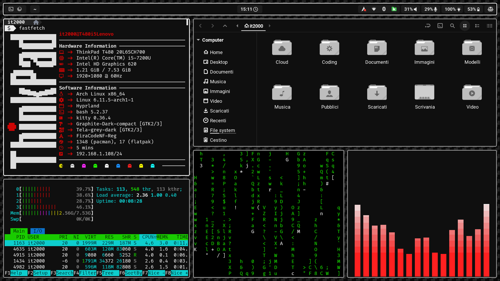
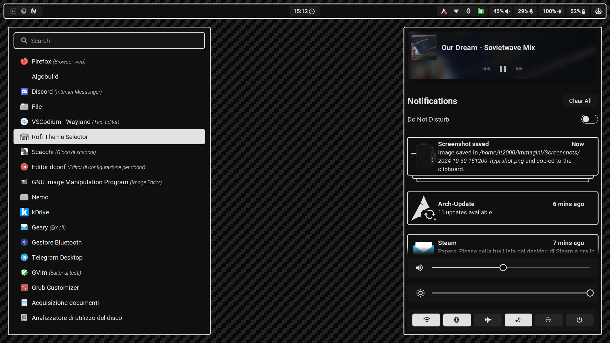
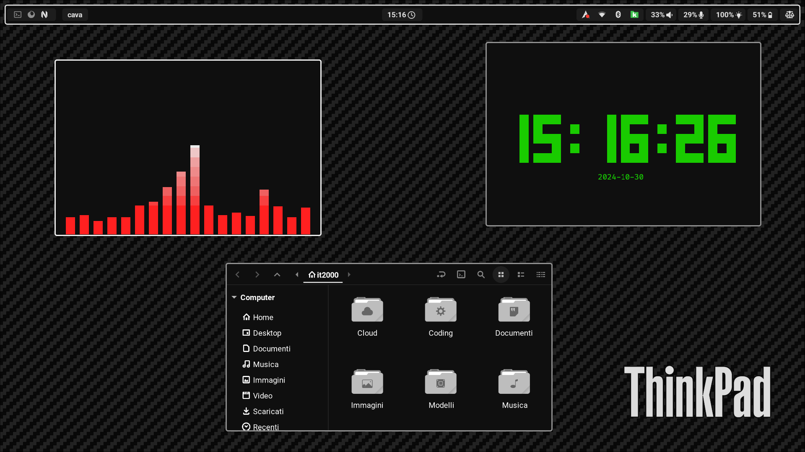

# ThinkPad Hyprland dotfiles

This is my first Hyprland rice setup for my ThinkPad T480, designed to reflect the style and aesthetic of the ThinkPad itself. I’ve chosen a carbon fiber wallpaper, inspired by the carbon fiber film I applied to the laptop's case. This setup is perfect for any ThinkPad user, offering a minimal environment free of unnecessary distractions (I’m not a fan of anime wallpapers), while including all essential utilities for users of various skill levels.

The layout has been meticulously designed: proportions such as gaps, margins, and angles have been calculated down to the pixel, and the color scheme consists of only black and white. This ensures a seamless, distraction-free interface, allowing the user to focus without unnecessary color variations. It perfectly embodies the precision and professionalism of the ThinkPad brand—timeless and refined.

## Configs
These dotfiles includes configs for:
- [Hyprland](https://github.com/hyprwm/Hyprland.git)
- [hypridle](https://github.com/hyprwm/hypridle.git)
- [hyprpaper](https://github.com/hyprwm/hyprpaper.git)
- [hyprlock](https://github.com/hyprwm/hyprlock.git)
- [Waybar](https://github.com/Alexays/Waybar.git)
- [kitty](https://github.com/kovidgoyal/kitty.git)
- [rofi](https://github.com/davatorium/rofi.git)
- [SwayNotificationCenter](https://github.com/ErikReider/SwayNotificationCenter.git)
- [bash](https://github.com/bminor/bash.git)
- [neofetch](https://github.com/dylanaraps/neofetch.git)
- [fastfetch](https://github.com/fastfetch-cli/fastfetch.git)
- [wlogout](https://github.com/ArtsyMacaw/wlogout)
- [wob](https://github.com/francma/wob.git)
- [gammastep](https://gitlab.com/chinstrap/gammastep)

The installation script does not include a function to install these packages automatically and, for this reason, you have to install them manually. This is to make this rice avaiable for every distro and not only for the arch-based ones.
## Dependencies
All of the software mentioned before are dependencies (with some exceptions) but, in addition, there are also these essential utilities required by the configs:
- [nm-applet](https://github.com/pavlix/nm-applet.git)
- [blueman](https://github.com/blueman-project/blueman.git)
- [nemo](https://github.com/linuxmint/nemo.git)
- [polkit-gnome](https://gitlab.gnome.org/Archive/policykit-gnome.git)
- [brightnessctl](https://github.com/Hummer12007/brightnessctl.git)
- [Roboto fonts](https://github.com/googlefonts/roboto-2.git)
- [Fira Code Nerd Fonts](https://www.nerdfonts.com/)
- [pulseaudio](https://github.com/pulseaudio/pulseaudio)
- [pavucontrol](https://github.com/pulseaudio/pavucontrol)
- [power-profiles-daemon](https://github.com/Rongronggg9/power-profiles-daemon.git)
## Themes and icons
The installation script will automatically install:
- [Graphite-gtk-theme](https://github.com/vinceliuice/Graphite-gtk-theme.git)
- [Graphite-cursors](https://github.com/vinceliuice/Graphite-cursors.git)
- [Tela-icon-theme](https://github.com/vinceliuice/Tela-icon-theme.git)
- [Trueline](https://github.com/petobens/trueline.git)
## Installation
To install the dotfiles you simply need to launch the installation script from any folder: `./install.sh` and, if you want to uninstall the dotfiles and themes, you can launch the installation script with the `-u` or `--uninstall` argument: `./install.sh --uninstall`
## Screenshots

